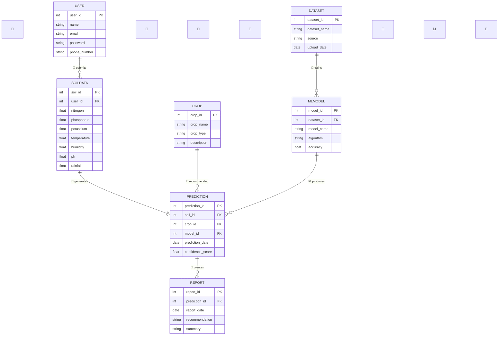

# 🌾 OptiCrop – Smart Agricultural Production Optimization System

```mermaid
erDiagram

    👤 USER {
        int user_id PK
        string name
        string email
        string password
        string phone_number
    }

    🌱 SOILDATA {
        int soil_id PK
        int user_id FK
        float nitrogen
        float phosphorus
        float potassium
        float temperature
        float humidity
        float ph
        float rainfall
    }

    🌾 CROP {
        int crop_id PK
        string crop_name
        string crop_type
        string description
    }

    📂 DATASET {
        int dataset_id PK
        string dataset_name
        string source
        date upload_date
    }

    🤖 MLMODEL {
        int model_id PK
        int dataset_id FK
        string model_name
        string algorithm
        float accuracy
    }

    📊 PREDICTION {
        int prediction_id PK
        int soil_id FK
        int crop_id FK
        int model_id FK
        date prediction_date
        float confidence_score
    }

    📑 REPORT {
        int report_id PK
        int prediction_id FK
        date report_date
        string recommendation
        string summary
    }

    USER ||--o{ SOILDATA : "🌱 submits"
    SOILDATA ||--|| PREDICTION : "🤖 generates"
    CROP ||--o{ PREDICTION : "🌾 recommended"
    DATASET ||--o{ MLMODEL : "📂 trains"
    MLMODEL ||--o{ PREDICTION : "📊 produces"
    PREDICTION ||--o{ REPORT : "📑 creates"
```
